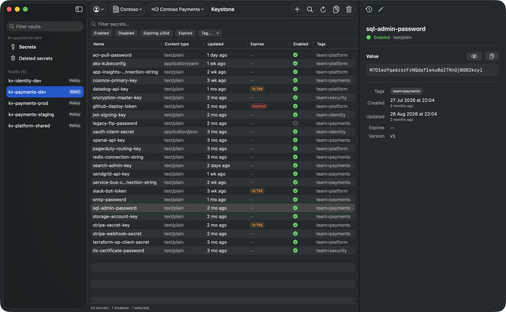
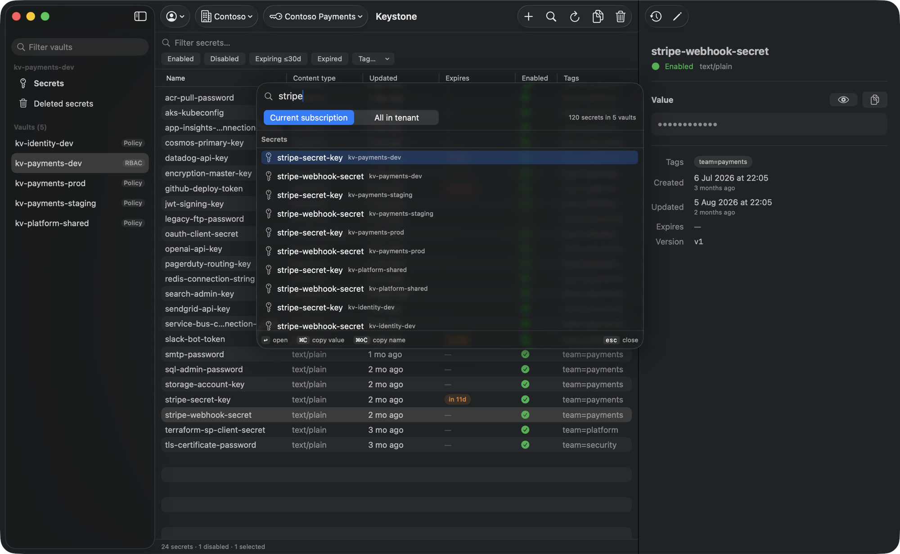
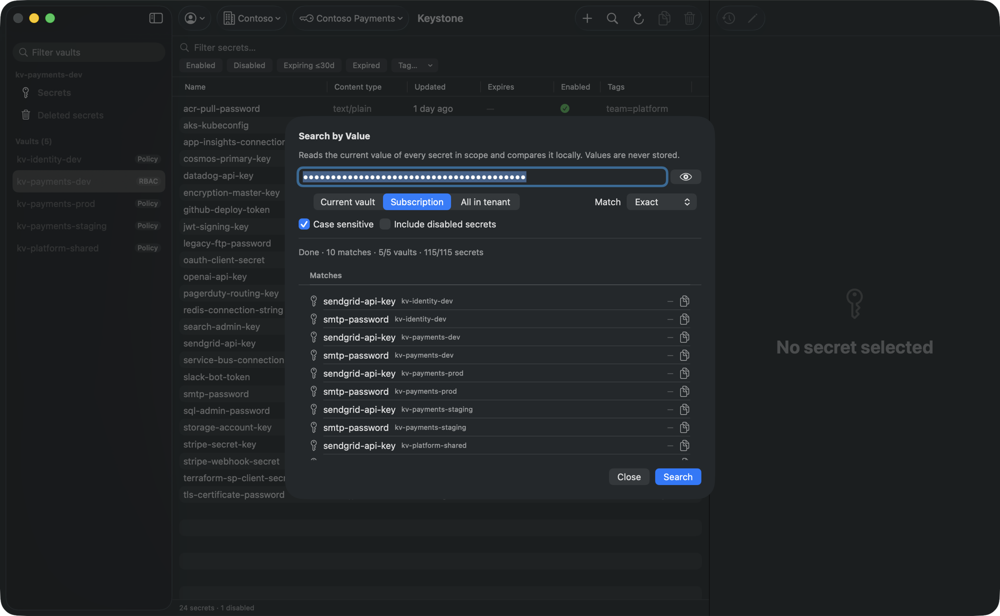
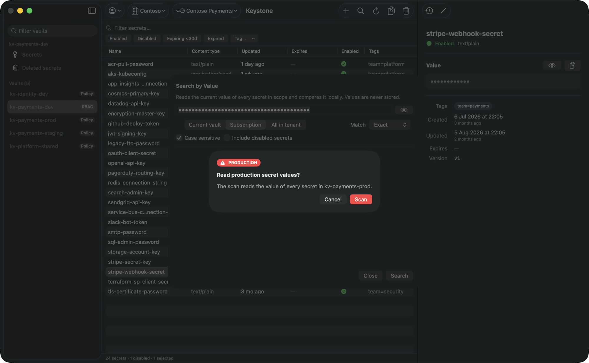

<div align="center">

# Keystone

**A fast, native macOS app for Azure Key Vault secrets.**

Browse, search and edit secrets across all your Azure accounts, tenants, subscriptions and vaults,
without opening the Azure portal.


[](https://github.com/takacj/keystone/actions/workflows/ci.yml)
[](LICENSE)



</div>

## Why Keystone
- **One window for every vault.** Switch between accounts, tenants and subscriptions in a click instead
  of juggling portal tabs and `az account set`.
- **Keyboard first.** ⌘K jumps to any secret in any vault, and every action has a shortcut.
- **Answers "where is this value used?"** Search by value finds every secret that holds a given
  connection string, key or password.
- **Safe by default.** Values stay masked, production vaults ask for confirmation, and nothing secret is
  written to disk.
- **No setup in Azure.** It signs in through the Azure CLI with your own permissions. No app
  registration, no client secret.

## Features

### Browse and edit
- Several Azure accounts side by side, each in its own isolated Azure CLI profile.
- Tenant → subscription → vault navigation with favorites and recents.
- Fast secrets table with fuzzy filtering, sorting and filter chips (enabled, disabled, expiring, expired, tag).
- Masked values with reveal, auto re-mask and concealed copy to the clipboard.
- Create secrets, set new values, edit metadata, and undo.
- Version history with restore; soft delete, recover and purge.

### Find anything
- **⌘K command palette** searches vault and secret names across the subscription or the whole tenant,
  then opens, copies the value or copies the name.

  

- **⇧⌘F search by value** finds which secrets hold a given value in the current vault, subscription or
  tenant. Exact or contains matching; values are read and compared in memory, never stored.

  

### Stay safe
- Touch ID app lock (⌘L).
- Extra confirmation for production vaults, with type-to-confirm for destructive actions.
- Readable Azure errors, e.g. a firewall-blocked vault shows your IP and how to allow it.

  

## Keyboard shortcuts
| Action | Shortcut |
| --- | --- |
| Command palette | ⌘K |
| Search by value | ⇧⌘F |
| Filter secrets | ⌘F |
| Reveal / hide value | Space |
| Copy value / name | ⌘C / ⇧⌘C |
| New / edit secret | ⌘N / ⌘E |
| Version history | ⌘Y |
| Delete | ⌘⌫ |
| Reload | ⌘R |
| Switch account / tenant / subscription | ⇧⌘A / ⇧⌘T / ⇧⌘S |
| Focus sidebar / list / detail | ⌘1 / ⌘2 / ⌘3 |
| Lock | ⌘L |

## How it works
- Authentication goes through the Azure CLI (`az`). No app registration or client secret is needed.
- Each account gets its own `AZURE_CONFIG_DIR` under `~/Library/Application Support/Keystone/profiles`,
  so your normal `~/.azure` login is never touched.
- Keystone keeps access tokens and secret values in memory only. On disk it stores account names,
  selections and settings, never secret values. The Azure CLI keeps its own login cache inside each
  profile folder, as it does in `~/.azure`.
- Keystone uses your own permissions: RBAC roles (Key Vault Secrets User / Officer) or access policies.

## Requirements
- macOS 26
- Azure CLI 2.60 or later: `brew install azure-cli`
- To build: Xcode 26, `brew install xcodegen swiftlint swift-format`

## Install
- `make dmg` builds `build/Keystone-<version>.dmg` (Release, universal, ad-hoc signed, not notarized).
- Open the DMG and drag **Keystone** to **Applications**.
- The app isn't notarized, so macOS blocks the first launch on other Macs: open System Settings →
  Privacy & Security → **Open Anyway**, or run `xattr -dr com.apple.quarantine /Applications/Keystone.app`.
- On first launch, add an account: Keystone runs `az login` in that account's own profile.

### Try it without Azure
Launch with mock data, no `az` or network needed:

```sh
open Keystone.app --args -UITestMode -UITestDemo
```

- `-UITestMode`: mock account, tokens and HTTP (`-UITestSecretCount N` sets secrets per vault).
- `-UITestDemo`: realistic demo vaults and secrets, as in the screenshots above.

## Build & test
- `make build`: generate the Xcode project (XcodeGen) and build.
- `make test`: KeystoneKit package tests plus app unit tests, including performance checks on mock data.
- `make test-ui`: XCUITest smoke tests against the mock environment. Needs a GUI session and
  Accessibility permission, and takes over the mouse and keyboard while it runs.
- `make lint` / `make format`: SwiftLint and swift-format.

### Integration tests (opt-in)
Skipped unless configured. They need a logged-in Keystone profile and two test vaults, one using RBAC and
one using access policies:

```sh
KEYSTONE_IT_PROFILE_DIR="$HOME/Library/Application Support/Keystone/profiles/<id>" \
KEYSTONE_IT_TENANT=<tenant-id> \
KEYSTONE_IT_VAULT_RBAC=https://<rbac-vault>.vault.azure.net \
KEYSTONE_IT_VAULT_POLICY=https://<policy-vault>.vault.azure.net \
make test-integration
```

## Project layout
- `App/`, `Features/`: the SwiftUI app (models and views).
- `KeystoneKit/`: Swift package with the Azure CLI runner, token provider, ARM and Key Vault clients,
  search and persistence.
- `Tests/`: app unit tests and UI tests.
- `docs/screenshots/`: README images, captured from the `-UITestDemo` mock environment.

## Contributing
- See [CONTRIBUTING.md](CONTRIBUTING.md) and the [Code of Conduct](CODE_OF_CONDUCT.md).
- Report security issues privately: [SECURITY.md](SECURITY.md).
- Release notes: [CHANGELOG.md](CHANGELOG.md).

## License
MIT. See [LICENSE](LICENSE).
